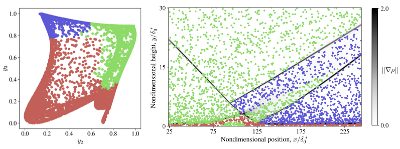
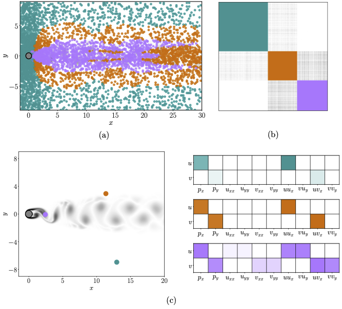
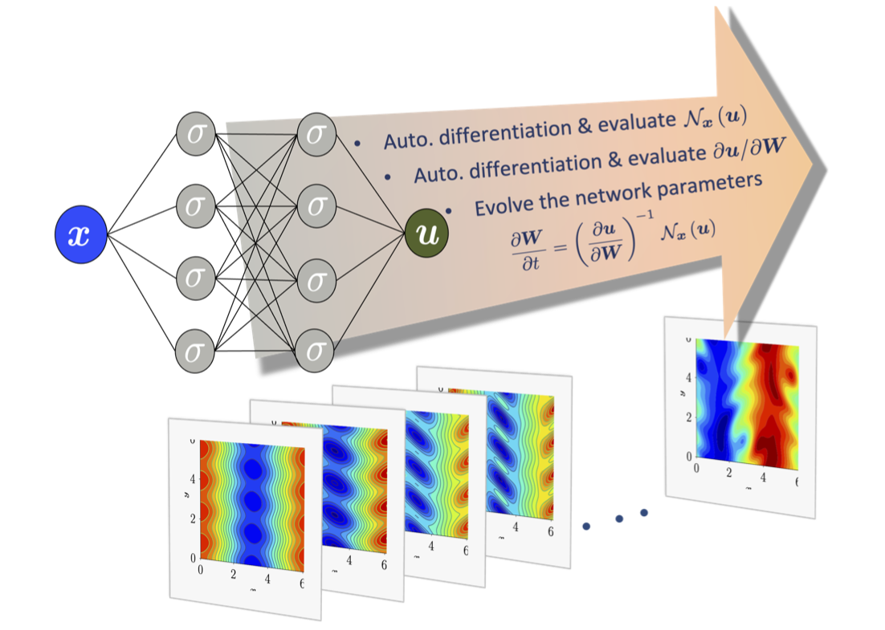

# Digital twin of Look-up libraries
Hypersonic flows are of great interest in a wide range of aerospace
applications and are a critical component of many technological 
advances. Accurate simulations of these flows in thermodynamic 
(non)-equilibrium (accounting for high temperature effects) rely 
on detailed thermochemical gas models. While accurately capturing 
the underlying aerothermochemistry, these models dramatically 
increase the cost of such calculations. In our group, we present 
a novel model-agnostic machine-learning technique to extract a 
reduced thermochemical model of a gas mixture from a library. 
A first simulation gathers all relevant thermodynamic states 
and the corresponding gas properties via a given model. The states 
are embedded in a low-dimensional space and clustered to identify 
regions with different levels of thermochemical (non)-equilibrium. 
Then, a surrogate surface from the reduced cluster-space to the 
output space is generated using radial-basis-function networks.
The method is validated and benchmarked on simulations of a 
hypersonic flat-plate boundary layer and shock-wave boundary layer 
interaction (shown in the figure below) with finite-rate chemistry. 
The gas properties of the reactive air mixture are initially 
modeled using the open-source Mutation++ library. Substituting 
Mutation++ with the light-weight, machine-learned alternative 
improves the performance of the solver by up to 70% while 
maintaining overall accuracy in both cases.

# Data-driven dynamic identification
With advances in computing power, larger and more accurate simulations are being performed, capable of capturing detailed interactions of various physical phenomena present in the flow. One of the main products of such expensive calculations is the resulting data, which is also increasing in size, opening the door to data-driven analysis, such as system identification and machine learning techniques.

In many regimes, the dynamics of physical systems, usually described by complex partial differential equations, are governed by only a few nonlinear terms, allowing the production of simpler models capable of predicting the main features of the underlying system. The determination of these structures inherent in such physical systems can be accomplished through the use of data-driven models and system identification. 

In our group we explore a data-driven dynamics identification procedure realized by coupling sparse linear regression with network partitioning used for clustering purposes.

# EDNN - AI-aided aolution of PDE's
Machine-learning (ML) holds significant promise in revolutionizing 
a wide range of applications, in particular in the domain of multi-scale
and multi-physics problems. Success in realizing the promise of ML
is predicated on the availability of training data, which are often
obtained from scientific computations. Conventional approaches to 
solving the equations of physics require difficult and specialized 
software development, grid generation and adaptation, and the use of 
specialized data and software pipelines that differ from those 
adopted in ML. A disruptive new approach that was recently proposed Zaki et al.
is Evolutional Deep Neural Networks (EDNN, pronounced “Eden”) which 
leverages the software and hardware infrastructure used in ML to replace 
conventional computational methods, and to tackle their shortcomings. 
EDNN is unique because it does not rely on training to express 
known solutions, but rather the network parameters evolve using the 
governing physical laws such that the network can predict the 
evolution of the physical system. In our group, we are furhutr  
developping the EDNN framework to solve high-dimensional partial 
differential equations, used to model a vast range of phenomena in 
economics, finance, operational research, and multi-phase fluid dynamics, 
where population balance equations govern phenomena as diverse 
as aerosol transmission of airborne pathogens or mixing enhancement 
in energy conversion devices. The simulation of such flows is an 
open issue of particular interest.  We will demonstrate the ease of 
software development using automatic differentiation tools and the 
capacity of EDNN to eliminate the curse of dimensionality and the 
tyranny of moment closure. Success stands to disrupt and transform the 
decades-old computational approach to solving nonlinear differential 
equations and to remove the barriers to generation of training data required for ML.

