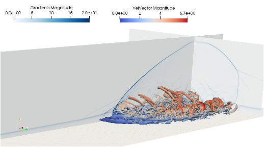

# Digital twin of Look-up libraries
Hypersonic flows are of great interest in a wide range of aerospace applications and are a critical component of many technological advances. Accurate simulations of these flows in thermodynamic (non)-equilibrium (accounting for high temperature effects) rely on detailed thermochemical gas models. While accurately capturing the underlying aerothermochemistry, these models dramatically increase the cost of such calculations. In this paper, we present a novel model-agnostic machine-learning technique to extract a reduced thermochemical model of a gas mixture from a library. A first simulation gathers all relevant thermodynamic states and the corresponding gas properties via a given model. The states are embedded in a low-dimensional space and clustered to identify regions with different levels of thermochemical (non)-equilibrium. Then, a surrogate surface from the reduced cluster-space to the output space is generated using radial-basis-function networks.
The method is validated and benchmarked on simulations of a hypersonic flat-plate boundary layer and shock-wave boundary layer interaction with finite-rate chemistry. The gas properties of the reactive air mixture are initially modeled using the open-source Mutation++ library. Substituting Mutation++ with the light-weight, machine-learned alternative improves the performance of the solver by 50% while maintaining overall accuracy in both cases.

# Data-driven dynamic identification

# EDNN - AI-aided aolution of PDE's
