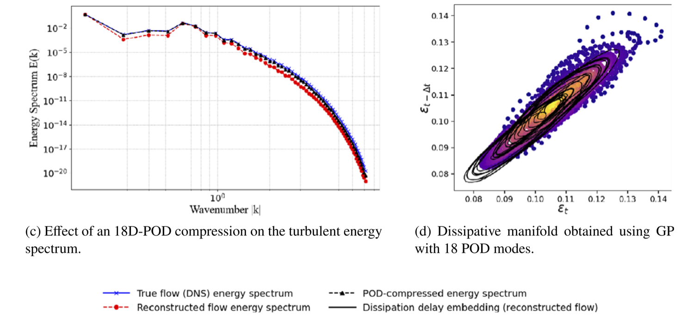

<link rel="stylesheet" href="../assets/css/custom.css">

# Robust Parametrised AI-Based ROMs

Reduced-order models (ROMs) must not only generalise across different dynamical regimes but also provide a measure of confidence in their predictions. We present UP-dROM (Uncertainty-aware and Parametrised dynamic Reduced-Order Model), a nonlinear reduction strategy specifically designed for transient flows. The approach combines a Variational Autoencoder (VAE) for probabilistic dimensionality reduction with a Transformer architecture that leverages attention mechanisms to capture temporal dependencies and parametric variations in the latent space. Cross-attention enables the model to generalise across a wide range of operating conditions defined by external parameters such as the Reynolds number and bluff body geometry. Uncertainty quantification is achieved at minimal computational cost and serves as a reliable proxy for model performance, enabling an adaptive sampling strategy that guides retraining toward regions of the parameter space where the model is least confident. The model achieves relative mean square errors below 0.5% on seen parameters and below 2.5% for interpolation tasks.

Confidence intervals for the U and V velocity fields at a fixed spatial location and parametrisation ξ: Re = 90.

Reference: <a href="https://doi.org/10.1103/f6ty-t6gl">Zighed et al., Physical Review Fluids (2025)</a>

# Stable AI-Based Models of Turbulent Flows

Simulating turbulent fluid flows is computationally prohibitive, requiring the resolution of fine-scale structures and the capture of complex nonlinear interactions across multiple scales. To overcome the instability of deterministic models in chaotic regimes, we develop two complementary approaches.

The first, a stochastic scale-separated framework, decomposes the flow into large-scale coherent structures and small-scale fluctuations. Large-scale dynamics are predicted using the UP-dROM architecture — a VAE–Transformer model trained on low-pass filtered flow data — which generates ensembles of statistically consistent trajectories with a Prediction Interval Coverage Probability (PICP) of ~80%. Small-scale closure is achieved using Gaussian Process (GP) regression in a POD-reduced space, providing a lightweight probabilistic mapping from filtered to full-resolution fields. The GP outperforms VAE and diffusion model baselines across all metrics, including first-moment errors and Continuous Ranked Probability Score (CRPS), while generating full dynamic rollouts with a single inference pass.

Reference: <a href="https://www.cambridge.org/core/journals/data-centric-engineering/article/leveraging-scale-separation-and-stochastic-closure-for-datadriven-prediction-of-chaotic-dynamics/4744603B7180F03808BE37612ADC2652">Zighed et al., Data-Centric Engineering (2026)</a>

The second approach introduces the Hierarchical Fourier Neural Operator (HFNO), which decomposes the Fourier domain into physically meaningful wavenumber bins — energy-containing, inertial, and dissipative scales — each processed by a dedicated neural network. This architecture achieves comparable accuracy to standard Fourier Neural Operators with five times fewer parameters, while offering interpretability at each scale. It has been validated on the Kuramoto–Sivashinsky equation, Kolmogorov flow, and wall shear stress prediction in turbulent channel flow.

Reference: <a href="https://arxiv.org/abs/2511.01535">Hierarchical Fourier Neural Operator, arXiv:2511.01535</a>

# ROMs for Sparse Observations and Flow Control

In many practical configurations, the full flow field is not directly accessible and the system must be inferred from sparse sensor measurements. We propose FiROM (Field Reconstruction from sparse observations ROM), an uncertainty-aware parametrised reduced-order modeling framework that reconstructs full flow fields from a limited number of sensors. The approach combines a sparse encoder based on a Variational Autoencoder, a Transformer rollout model with cross-attention for parameter conditioning, and a Feature-wise Linear Modulation (FiLM) mechanism that adapts the model to varying operating conditions. Sensor locations are selected offline using a POD-based QR pivoting strategy to maximise reconstruction quality. The framework provides uncertainty estimates in space, time, and across the parameter space, making it suitable for realistic flow monitoring and control scenarios. It has been validated on Reynolds-number-parametrised flow past an obstacle and on the fluidic pinball configuration, a three-cylinder system parametrised by independent rotational boundary conditions.
