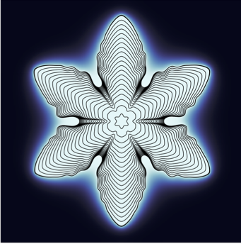

# Hypersoninc flows in non-equilibrium 
The numerical tools are developed based on previous in-house 
codes for high-speed simulations with improvements in both 
numerical and physical modeling.  Additionally, a modular, 
open-source library is coupled with the flow solver for modeling 
real-gas effects in variable atmospheric mixtures. Verification 
against literature is done for canonical flat-plate boundary 
layers with various choices for gas modeling, with excellent 
agreement observed in all cases. The implementation of an 
artificial-diffusivity shock-capturing numerical scheme is 
then verified for supersonic shockwave--boundary-layer 
interaction (SBLI) cases and the improved code's capabilities 
are demonstrated for the cases of hypersonic SBLI and a 
sonic jet injection in a hypersonic crossflow, at higher 
enthalpy levels than those previously investigated. 
The results show excellent agreement with previous observations 
in the literature. The work presented in this paper demonstrates 
the range of applications that can be investigated with this 
tool, highlights the need for accurate physicochemical 
modeling, and paves the way for addressing increasingly 
more complex configurations and flows.

# Interfacial flows with phase-change
The treatment of complex geometries in Computational Fluid Dynamics applications is a challenging endeavor, which immersed boundary and cut-cell techniques can significantly simplify by alleviating the meshing process required by body-fitted meshes. These methods however introduce new challenges, as the formulation of accurate and well-posed discrete operators becomes nontrivial. Here, a conservative cartesian cut cell method is proposed for the solution of the incompressible Navier--Stokes equation on staggered Cartesian grids. Emphasis is set on the structure of the discrete operators, designed to mimic the properties of the continuous ones while retaining a nearest-neighbor stencil. For convective transport, a divergence is proposed and shown to also be skew-symmetric as long as the divergence-free condition is satisfied, ensuring mass, momentum and kinetic energy conservation (the latter in the inviscid limit). For viscous transport, conservative and symmetric operators are proposed for Dirichlet boundary conditions. Symmetry ensures the existence of a sink term (viscous dissipation) in the discrete kinetic energy budget, which is beneficial for stability. The cut-cell discretization possesses the much desired summation-by-parts (SBP) properties. In addition, it is fully conservative, mathematically provably stable and supports arbitrary geometries. The accuracy and robustness of the method are then demonstrated with flows past a circular cylinder and an airfoil.

