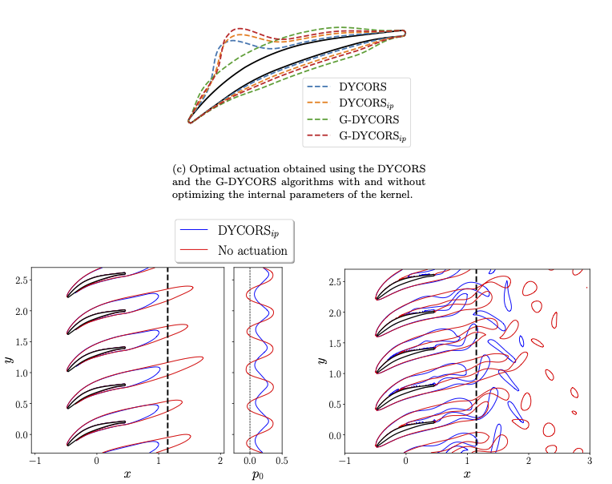
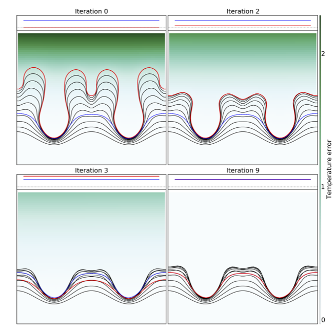
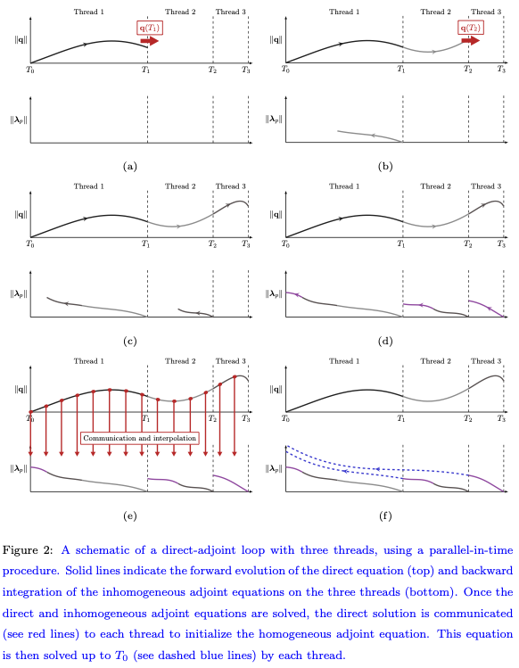

# Multi-fidelity stochastic optimisation of flows
Optimization and control of complex unsteady flows remains an important challenge due to the large cost of performing a function evaluation, i.e. a full computational fluid dynamics (CFD) simulation. Reducing the number of required function evaluations would help to decrease the computational cost of the overall optimization procedure. In this article, we consider the stochastic derivative-free surrogate-model based Dynamic COordinate search using Response Surfaces (DYCORS) algorithm and propose several enhancements: First, the internal parameters of the radial basis function employed to generate the surrogate model are optimized. Second, the gradient information is added to the surrogate model to improve its accuracy and enhance the convergence rate of the algorithm. We apply the resulting optimization algorithm to the minimization of the total pressure loss through a linear cascade of blades, and we compare the results obtained with the stochastic algorithms at different Reynolds numbers with a gradient-based optimization algorithm. The results show that stochastic optimization outperforms gradient-based optimization even at very low $Re$ numbers, and that the proposed gradient-enhanced version improves the convergence rate of the original algorithm.

# Optimisation of phase change and interfacial flows
A range of optimization cases of two-dimensional Stefan problems, solved using a tracking-type cost-functional, is presented. A level set method is used to capture the interface between the liquid and solid phases and an immersed boundary (cut cell) method coupled with an implicit time-advancement scheme is employed to solve the heat equation. A conservative implicit-explicit scheme is then used for solving the level set transport equation. The resulting numerical framework is validated with respect to existing analytical solutions of the forward Stefan problem. An adjoint-based algorithm is then employed to efficiently compute the gradient used in the optimisation algorithm (L-BFGS). The algorithm follows a continuous adjoint framework, where adjoint equations are formally derived using shape calculus and transport theorems. A wide range of control objectives are presented, and the results show that using parameterised boundary actuation leads to effective control strategies in order to suppress interfacial instabilities or to maintain a desired crystal shape.

# Parallel-in-time adjoint-based optimisation
Gradient-based optimization algorithms, where gradient information is extracted using adjoint equations, are efficient but can quickly slow down when applied to unsteady and nonlinear flow problems. This is mainly due to the sequential nature of the algorithm, where the primal problem is first integrated forward in time, providing the initial condition for the adjoint problem, which is then integrated backward. In order to address the sequential nature of this optimisation procedure parallel-in-time algorithms can be employed. However, the characteristics of the governing equations of interest in this work, and in particular, the divergence-free constraint (incompressibility effect) as well as the nonlinearity and the unsteadiness of the flow, make direct application of existing parallel-in-time algorithms less than straightforward. In this work, we introduce a parallel-in-time procedure, applied to the integration of the adjoint problem, which addresses all the existing constraints and allows quick access to local gradients. The performance of the proposed algorithm is assessed for both steady and unsteady actuation; in both cases it readily outperforms the sequential algorithm.

