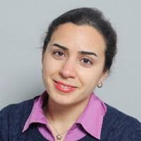

<!-- Link to the custom CSS -->
<link rel="stylesheet" href="assets/css/custom.css">

<!-- Custom header section with blue background -->

  <h1>Taraneh SAYADI</h1>
  
taraneh.sayadi@lecnam.net

  

# Teaching

* [UM5MEF41 - Optimisation algorithms](MU5MEF41/index.md)
* [MU4MEF01 - Numerical methods for linear PDEs](MU4MEF01/index.md)
* MU4MEM02 - Numerical methods for non-linear PDE's
* MU4MEF08 - Hydrodynamic instability

# Research

* [AI-driven modeling](AIFM/index.md)
* [Multi-fidelity optimisation](OFM/index.md) 
* [Simulations of complex flows](CFD/index.md)
* [Sensitivity analysis and uncertainty quantification](UQ/index.md)

# Open positions
* [Internship openings](STAGE/index.md)
* [PhD openings](PHD/index.md)
* [PostDoc openings](POSTDOC/index.md)
 
# [Papers](Papers/index.md)
 
# [CV](CV/index.md)

